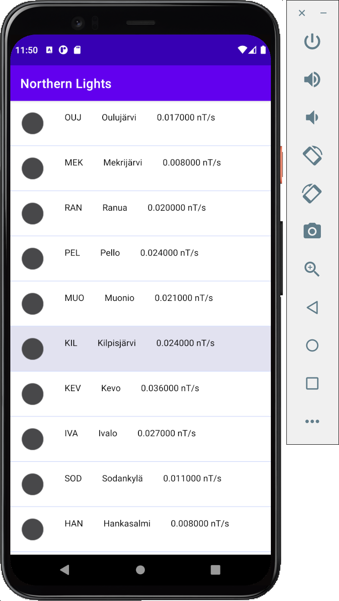
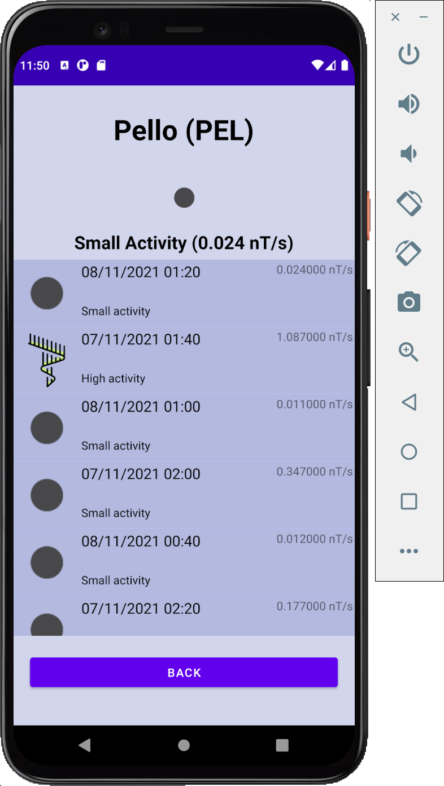

# Northern Lights - Final course project with Android Studio & Java

App shows the probability of northern lights and the history of last 24 hours. I have a script at my web hotel user that fetches every 5 minutes magnetic ac-tivity data from ilmatieteenlaitos.fi and saves it into MySQL database. The lat-est data will be saved into json file and can be fetched from the server. I also have some PHP scripts that allows to search for day data from the last few years, but I didn’t have time to implement it to the app.

In the main page the app has a list view of all 11 measuring stations and by clicking them you can see more data in a new view. If the activity is high, there will be an icon of northern lights and otherwise a black circle. In the detail view is a list view that shows the activity on every 10 minutes and the top of screen, there is the station name, current activity, and the probability to see northern lights.

 

## Screenshots

 

---

